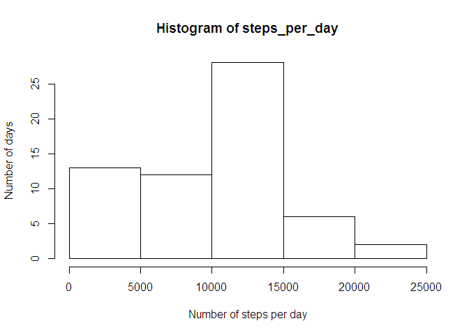
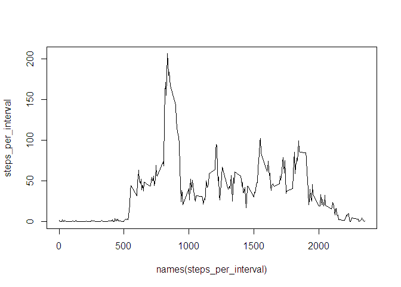
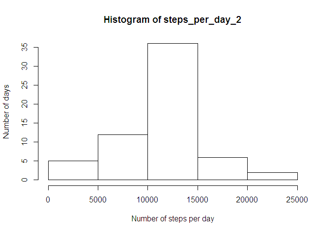
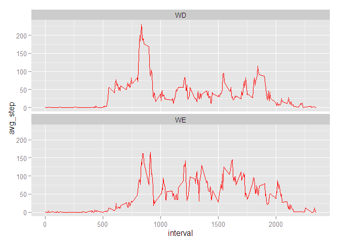

# Reproducible Research: Peer Assessment 1


## Loading and preprocessing the data

```r
activity <- read.csv(unzip("activity.zip"))
library(lubridate)
activity$date <- ymd(activity$date)
```


## What is mean total number of steps taken per day?

```r
steps_per_day <- tapply(activity$steps, activity$date, sum, na.rm = TRUE)
hist(steps_per_day, xlab = "Number of steps per day", ylab = "Number of days")
```

 

```r
mean_steps <- mean(steps_per_day)
median_steps <- median(steps_per_day)
```

The mean steps per day is 9354.2295082

The median steps per day is 10395

## What is the average daily activity pattern?

```r
steps_per_interval <- tapply(activity$steps, activity$interval, mean, na.rm = TRUE)
plot(names(steps_per_interval), steps_per_interval, type = "l")
```

 

```r
max_interval <- names(which.max(steps_per_interval))
```

Maximum number of steps is in interval 835


## Imputing missing values

```r
missing_values <- is.na(activity$steps)
number_miss_value <- sum(missing_values)
```

Number of missing values in data set are 2304

Lets fill the missing values with the mean of the steps in that interval

```r
steps_df <- data.frame(steps = steps_per_interval[1:nrow(steps_per_interval)], interval = as.numeric(names(steps_per_interval)))

activity_2 <- activity
for( i in 1:nrow(activity_2)) {
        if(is.na(activity_2$steps[i])){
                activity_2$steps[i] = steps_df$steps[steps_df$interval== activity_2$interval[i]]
        }
        
}
steps_per_day_2 <- tapply(activity_2$steps, activity_2$date, sum, na.rm = TRUE)
hist(steps_per_day_2, xlab = "Number of steps per day", ylab = "Number of days")
```

 

```r
mean_steps_2 <- mean(steps_per_day_2)
median_steps_2 <- median(steps_per_day_2)
```

The mean steps per day after imputation is 1.0766189\times 10^{4}

The median steps per day after imputation is 1.0766189\times 10^{4}

## Are there differences in activity patterns between weekdays and weekends?


```r
for( i in 1:nrow(activity_2)) {
        if(weekdays(activity_2$date[i]) %in% c("Monday", "Tuesday", "Wednesday", "Thursday", "Friday")) {
                activity_2$weekday[i] = "WD"
        } else {
                activity_2$weekday[i] = "WE"
        }
        
}

activity_2$weekday <- as.factor(activity_2$weekday)

library(dplyr)
```

```
## 
## Attaching package: 'dplyr'
## 
## The following objects are masked from 'package:lubridate':
## 
##     intersect, setdiff, union
## 
## The following objects are masked from 'package:stats':
## 
##     filter, lag
## 
## The following objects are masked from 'package:base':
## 
##     intersect, setdiff, setequal, union
```

```r
library(ggplot2)

activity_3_split <- group_by(activity_2, weekday, interval) %>% summarize(avg_step = mean(steps))

ggplot(activity_3_split, aes(interval, avg_step)) + geom_line(color= "red") + facet_wrap( ~weekday, nrow =2)
```

 


